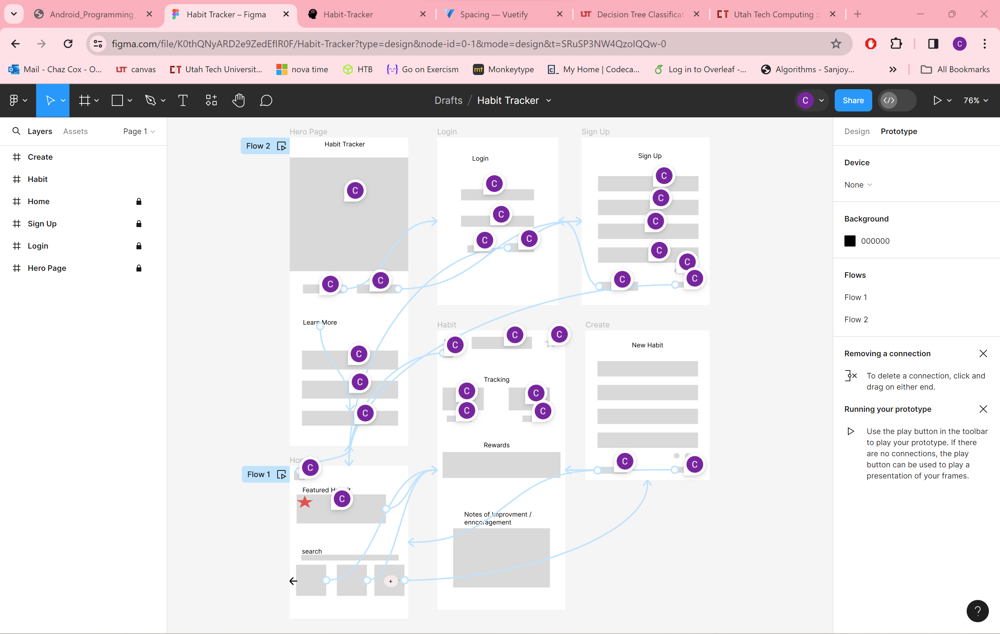
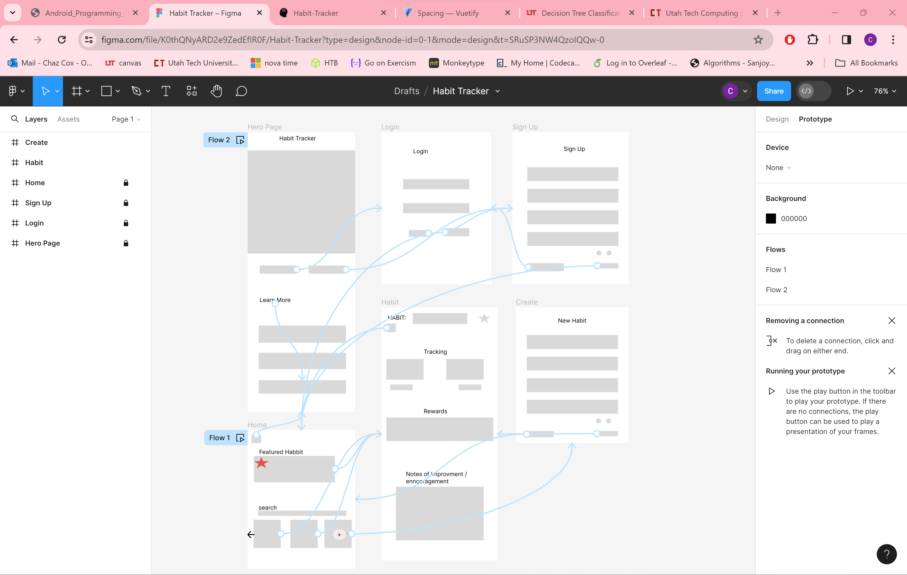
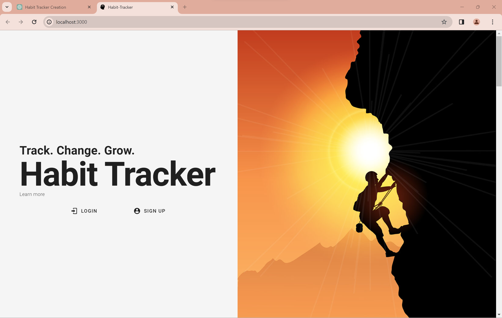
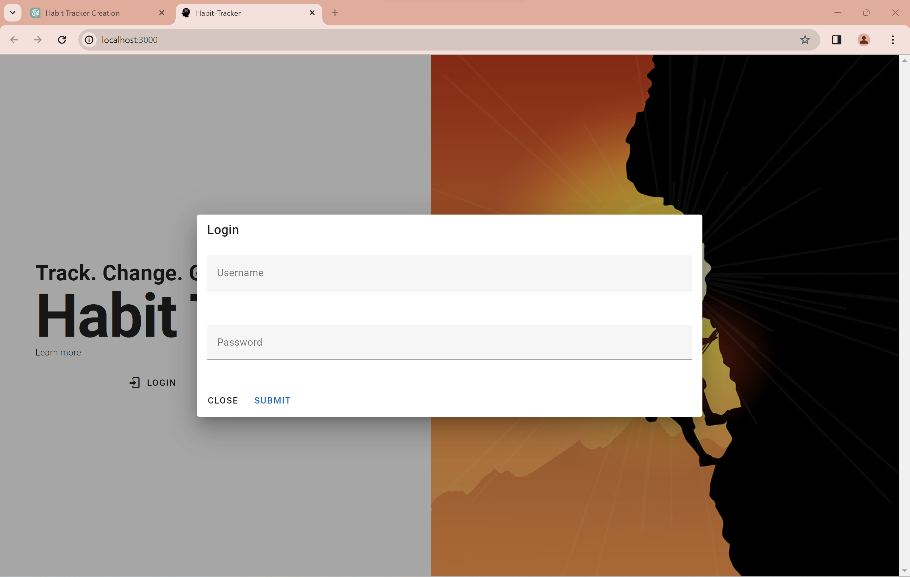
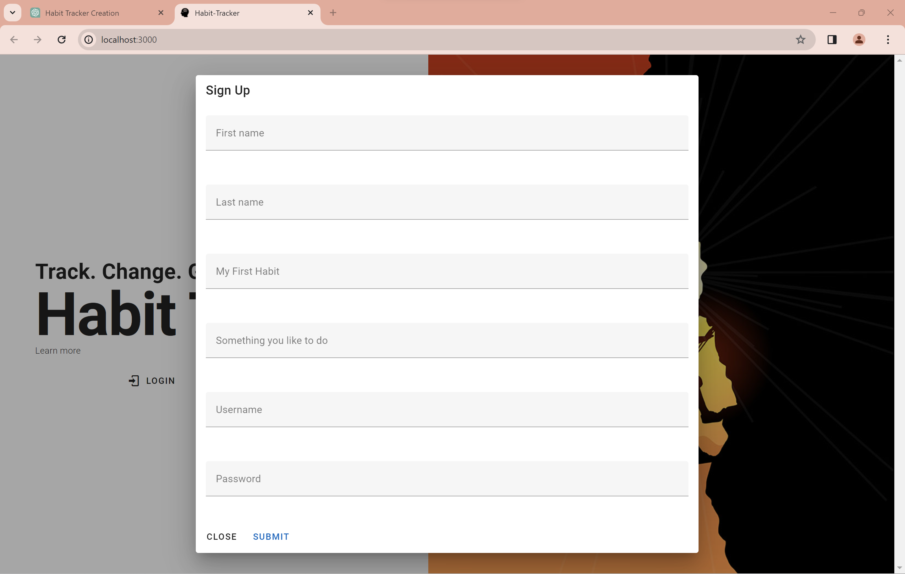
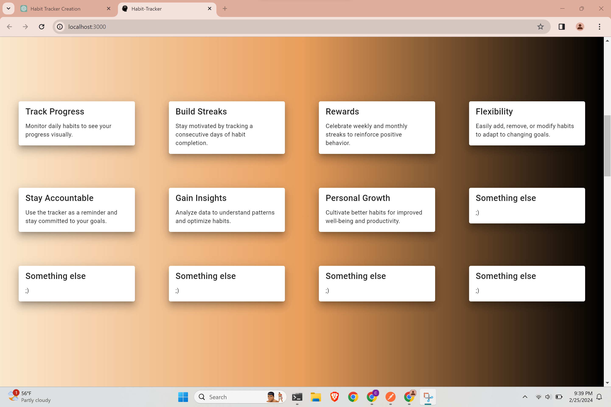
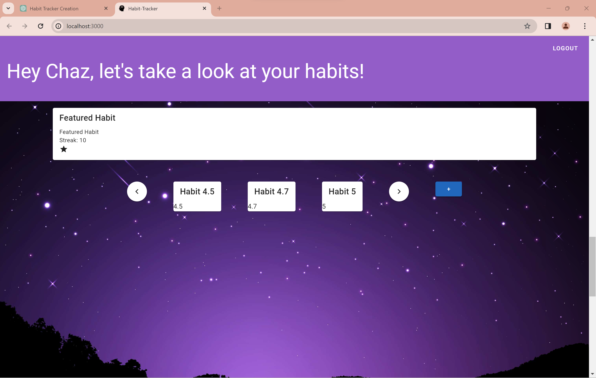
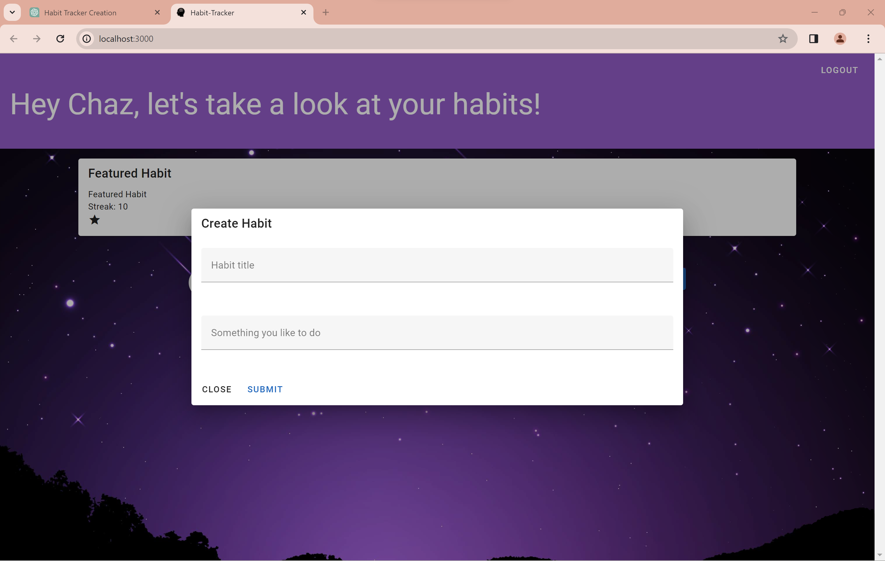
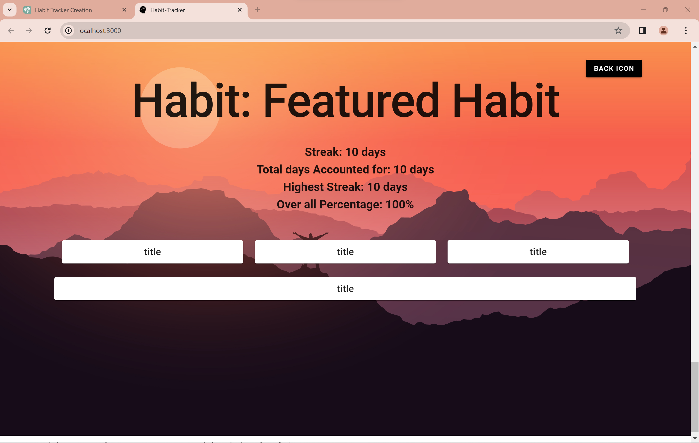

# Habit Tracker
## URLS:
Client: netlify  
(http://)[]  
Server: render  
(http://)[]  

### Stack

#### Client
 - Vue
 - Vuetify
 - TypeScript
 - Html and CSS

#### Server
 - Node
 - Express
 - MongoDB
 - Mongoose
 - javascript

### Collections

 - User: a user account
 - Habits: a habit they want to work on
 - Goals: smaller goals to keep the user on track
 <!-- - Rewards: a reward for accomplishing goals -->
 <!-- - Slips: when a streak is broken or a goal isnt achived, a log to help learn an stay accountable -->
 <!-- - Unexpected: a helpful feature when life happens -->

### Attributes / Schemas

#### User
- FirstName *string*
- LastName *string*
- UserName *string*
- Password *string*

#### Habits

 - UserId *a user type id*
 - Title *string*
 - Description *string*
 - Gaining New Habit Or Breaking Old Habit *boolean*
 - Is Featured *boolean*
 - Current Streak *Number*
 - Longest Streak *Number*
 - Number Of Days *Number*
 - Goals *an array of goal types ids*
 - Reward *a reward type ids*
 - Slips *an array of slip types ids*
 - Notes *string*
 - Date *date*
 
#### Goals 

 - HabitId *a habit type id*
 - Title *string*
 - description *string*
 - rewards *an array of reward types ids*
 - How Often *Number*
 - Repeats *boolean*
 - notes *string*

<!-- #### Rewards -->

<!-- #### Slips -->

### Endpoints

be sure to edit this later

| Collection | Endpoint       | Method | Description                 |
|------------|----------------|--------|-----------------------------|
| Users      | /api/users/check-username     | GET    | checks if username is available|
|            | /api/users/:id/name | GET    | Get's user's firstname user by ID              |
|            | /api/users     | POST   | Create a new user           |
| Sessions   | /api/sessions  | GET    | Get all sessions            |
|            | /api/sessions  | POST   | Create a new session        |
| Habits     | /api/habits    | GET    | Get all habits              |
|            | /api/habits/:id | GET | Get habit by ID             |
|            | /api/habits    | POST   | Create a new habit          |
|            | /api/habits/:id?*things to edit* | PUT | Update habit by ID          |
|            | /api/habits/:id | DELETE | Delete habit by ID       |
| Goals      | /api/goals?habit=*habitid*     | GET    | Get all goals               |
|            | /api/goals/:id | GET    | Get goal by ID              |
|            | /api/goals     | POST   | Create a new goal           |
|            | /api/goals/:id?*things to edit* | PUT    | Update goal by ID           |
|            | /api/goals/:id | DELETE | Delete goal by ID           |
<!-- |            | /api/users/:id | PUT    | Update user by ID           | -->
<!-- |            | /api/users/:id | DELETE | Delete user by ID           | -->
<!-- | Rewards    | /api/rewards   | GET    | Get all rewards             | -->
<!-- |            | /api/rewards/:id | GET  | Get reward by ID            | -->
<!-- |            | /api/rewards   | POST   | Create a new reward         | -->
<!-- |            | /api/rewards/:id | PUT | Update reward by ID         | -->
<!-- |            | /api/rewards/:id | DELETE | Delete reward by ID     | -->
<!-- | Slips      | /api/slips     | GET    | Get all slips               | -->
<!-- |            | /api/slips/:id | GET    | Get slip by ID              | -->
<!-- |            | /api/slips     | POST   | Create a new slip           | -->
<!-- |            | /api/slips/:id | PUT    | Update slip by ID           | -->
<!-- |            | /api/slips/:id | DELETE | Delete slip by ID           | -->

<!-- ### Encryption -->

## Plan of Execution

### Wireframes

The wireframes were good draft. After some user testing, things changed a little bit.

### Mock-ups (by html and css)

I really liked the dialog idea.

<!-- ### Learned -->
<!-- I had a lot of fun building this project. The big take-a-way from this project is how I decided to organize my code. I took time to put things in order and it all lookes good. -->
